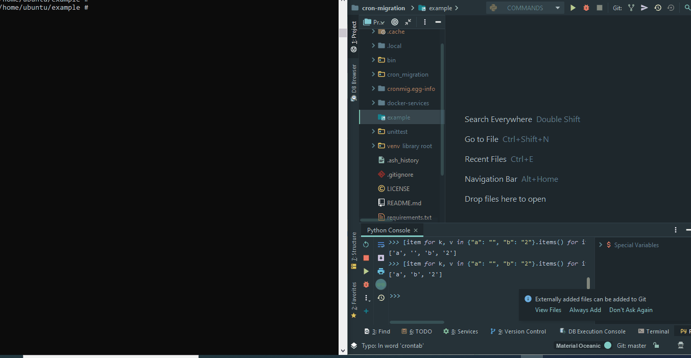

# python-cron-migration
python-cron-migration is a CLI package that was built for helping you manage your cronjobs by revisions files system.
It contains two main components:
1. a CLI revision system, which can generate/upgrade/downgrade revision files by simple commands.
2. a lightweight crontab high-level package which integrates with the `crontab` library on your OS


## commands 
| entry point | command | example | description |
| ----------- |---------|------|-------------|
| cronmig | init | cronmig init | initializes a new environment |
| cronming-revision | make | cronmig-revision make `[filename]` | generates a new revision file . `[filename]` should be a short description of your revision file|
| cronming-revision | upgrade | cronmig-revision upgrade | upgrades all non-upgraded files by invoking the `upgrade` method within your revision file |
| cronming-revision | downgrade | cronmig-revision downgrade `[steps]`  | downgrades revisions files `[steps]` times. `[steps]` is the number of downgrading (from the most upgraded file) | 

 

# System requirements
1. unix OS
2. crontab installed on your machine 

## Installation

### pip
pip install itay-bardugo-cron-migration -U


## Usage
### Basic Usage

1. init a new environment
    1. `cd` to your desired path
    1. run `cronmig init`.
    1. this command composes a new `cronjobs` folder with all needed files.
    1. its recommended to run this command from your top root folder.
    1. 
        ```
        +-- project (-> you are here)
        |   +-- unittest
        |   +-- project
        |       +-- systemfile.py
        ```
   1. upload`cronjobs/revisions` folder to git. (do not upload any other file.)
1. generate a new revision file
    1. `cd` to the path where `cronjobs` was installed (do not `cd` into `cronjobs` folder)
    1.  run `cronmig-revision make [replace-with-short-description]`
    1.  this commands generates a new revision file
    1.  add this file to GIT or any other VCS (**important**)
1. upgrade 
    1. `cd` to the path where `cronjobs` was installed (do not `cd` into `cronjobs` folder)
    1.  run `cronmig-revision upgrade`

### Branching
Once you create a new branch, you should tell `python-cron-migration` to start a new revision file, which represents the 
**beginning** of your changes of the current branch (because all of the revision files from all branches are exist within the "master" repo)
in order to separate non-relevant revision files and treat it like it was the first revision file that was ever made.
In oredr to make it happen, just use the `-h`(short of "head") flag when running `cronmig-revision make [message]` command.

Actually it looks like this:
`cronmig-revision make -h "my new revision head file"`
it creates a new revision file, but with no reference to the any previous revision file.

 
## Testing

``` bash
 cd unittest
 python application.py ApplicationTest.test_app  
```

## Security

If you discover any security related issues, please email itaybardugo91@gmail.com instead of using the issue tracker.


## License

The MIT License (MIT). Please see [License File](LICENSE) for more information.
